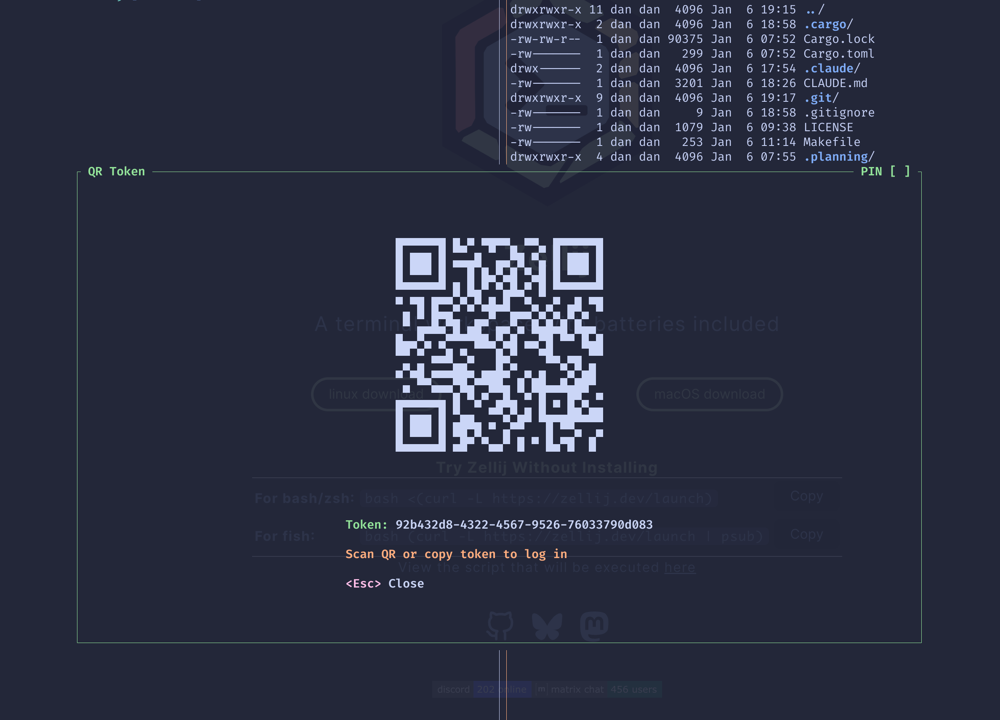

# qr-share

A Zellij plugin that generates QR codes for web login tokens.



## Features

- Automatically generates a web login token when opened
- Displays scannable QR code directly in the terminal
- Shows token text for manual copy as fallback

## Installation

Download the latest release or build from source:

```bash
cargo build --release
cp target/wasm32-wasip1/release/qr-share.wasm ~/.config/zellij/plugins/
```

## Usage

Add a plugin alias and keybinding to your `~/.config/zellij/config.kdl`:

```kdl
// Plugin alias with pre-granted permissions (no permission prompts)
plugins {
    qr-share location="file:~/.config/zellij/plugins/qr-share.wasm" {
        StartWebServer true
        ChangeApplicationState true
    }
}

// Keybinding (add to your keybinds section)
keybinds {
    session {
        bind "q" {
            LaunchOrFocusPlugin "qr-share" {
                floating true
                move_to_focused_tab true
            }
            SwitchToMode "normal"
        }
    }
}
```

Then press `Ctrl+O q` to open the plugin (session mode → q).

### Controls

- `Esc` - Close plugin

## Requirements

- Zellij 0.43.0+ with web UI enabled

## License

MIT
